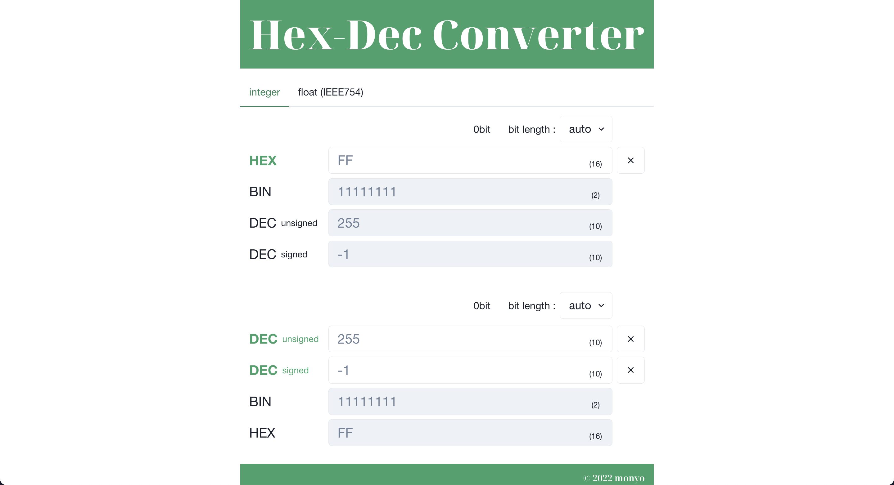

# Hex-Dec-Converter（16 進数-10 進数変換アプリ）

https://www.hexdecconverter.com/

## このアプリについて

16 進数で数値を入力すると、10 進数、2 進数表記に変換してくれる。その逆も可。  
符号あり整数(signed)と符号なし整数(unsigned)、浮動小数点（IEEE754）の三つの表現に対応している。

整数は 8 から 32bit まで、浮動小数点は 32bit に対応。

### 開発動機

開発動機を一言で言うと、「自分が欲しいもので、かつ自分のレベルで作れそうだったから」である。

普段バイナリファイルを扱うため、手軽に中の数値を確認できるアプリが欲しいと以前から思っていた。

というのも、こういった 16 進数-10 進数変換アプリは世の中に多く存在するが、符号あり整数と符号なし整数の両方に対応しているものはまれであるからである。  
加えて、浮動小数点に対応しているものは 1 つ、2 つしか見当たらず、いずれも UI に不満があったため、これら３つの表現方法に対応した変換ツールがあれば良いのにと思った。

そこで、ちょうど自分のブログ（ https://github.com/ynishisaki/myblog )が完成したので、web アプリ制作第二弾として、16 進数-10 進数変換アプリの制作に取り組むことにした。

また、2 の補数表現や IEEE754、IBM float について、もう少し詳しく勉強したいと思っていたので、それらの勉強も兼ねている。

### 既存の 16 進数-10 進数変換アプリの特徴

#### 変換対象

-   2 進数、8 進数、10 進数、16 進数
-   オプションで基数を自由に設定できるものもあった。

#### 操作方法

以下の 3 工程からなる。

1. input に値を入力
2. select で変換方法を指定
   入出力の精度（2 の補数表現と浮動小数点で必要）、入出力の基数、符号の有無など
   アプリによっては、指定がないものもある。
3. 変換実行ボタンを押す
   すると変換結果、もしくはエラーが出力される
   アプリによっては、input に入力と同時に変換処理が実行されるものもある。この場合、入力が有効でない場合は、変換結果が出力されない（0 表示）。

#### デザイン

-   使い方の説明がなくても、直感的に使用できる。日本語以外のアプリでも普通に使える。  
    おそらく、そもそもアプリを使うのに必要な操作の手数が少なく、単純だからだろう。

-   が、オプションの指定項目が多いほど、使いづらくなる。  
    これは、単純に手数が増えるのと、サイトごとにオプションの指定項目が異なるため。

-   一昔前のウェブサイトのようなデザインが多い。

-   変換フォーム自体はシンプルなデザインが多い。  
    が、広告が至る所に貼ってあるサイトが多く、その結果全体的にごちゃごちゃした印象を受ける。

#### 現状の問題点と、改善点

変換の多機能さ（変換オプションの多さ）と、シンプルさ（操作の手数の少なさ）の両立ができていない。  
→ select で指定するオプションを減らせば良い。

-   符号あり整数と符号なし整数の両方に同時に変換できるようにし、select での指定は削除した。
-   出入力の精度は、入力値から自動で推測するようにし、基本的に指定は不要とした。
    が、もし必要であれば、select での指定もできるようにした。

### 技術選定など

以下のようなことを考えた。

-   「値を入力後、変換ボタンを押す。すると変換結果が出力される」のではなく、値の入力と同時に 16 進数-10 進数の変換結果が出力されるようにしたい。
    → React の useState で実装可能と判断。

-   16 進数-10 進数-2 進数間の変換も、JavaScript で行いたい。  
    → 調べた結果、JavaScript でも 32bit まではビット演算ができることがわかったため、いけると判断。

-   広告があると気が散るので、広告なしのアプリにする。  
    → これは簡単！

### 技術的特徴

-   言語は、TypeScript。

-   Next.js/React.js を使用。

-   16 進数-10 進数-2 進数間の変換の実装方法は、以下の通り。  
    符号なし整数...parseInt()  
    符号あり整数...parseInt()、ビット演算  
    浮動小数点...ArrayBuffer、DataView

-   無効な値を入力をさせないための入力制限  
    input タグの入力を正規表現で徹底的に制限し、handleChange の度に変換処理を実行するという設計にしてある。  
    例えば、マイナス"-"は二つ以上入力できないし、一文字目以降に-を入力しても弾かれるように作ってある。符号なし整数ならば、そもそも-が入力できないよう設計してある。  
    （もし入力できてしまった場合は、お知らせいただけると嬉しいです。）

-   入力値から bit 数を推定する  
    特に、2 の補数表現では、最上位ビットの値が問題になるため、変換には値の入力と共に精度を指定する必要がある。  
    本アプリは精度が指定されていなくても、入力値から自動で最小の精度を推測して、変換結果を出力するようになっている。

-   符号あり整数、符号なし整数の両方に同時変換可能  
    この機能を搭載したアプリがほとんど見当たらず、個人的に不満だったため。

-   整数への変換と、浮動小数点への変換を、同一ページに実装  
    この機能を搭載したアプリがほとんど見当たらず、個人的に不満だったため。

-   UI ライブラリとして、Chakra UI を使用。

-   PC で使用することを想定しているが、一応レスポンシブ対応。

### 感想

-   改めて JavaScript の number 型ってだいぶ特殊だなと感じた。  
    たとえば、数字の類は全て number 型にまとめられている点など。

-   既存の 16 進数-10 進数変換ツールを色々調査して、どんな UI/UX だと使いやすいのか、どうやったら求める機能を実装できるか考えるのが面白かった。  
    特に、Windows にデフォルトで入っている電卓アプリが非常に良かったので、大いに参考にした。

-   符号なし整数、符号あり整数、浮動小数点に対応した入力制限を正規表現で作る部分で想像以上に苦戦した。  
    今回のアプリ制作を通して正規表現に強くなったし、のちに web スクレイピングする際に大いに役立った。

-   世の中にある 16 進数-10 進数変換ツールの中でも、最も自分が使いたいと思えるアプリができて非常に満足している。いつもこのアプリを愛用している。そしてバグを発見しては直している。

### 今後の課題

-   64bit まで対応できるように拡張したい。  
    32bit 以上の場合、JavaScript のビット演算の問題があるので、32bit 以下とは別の方法で実装する必要がある。
